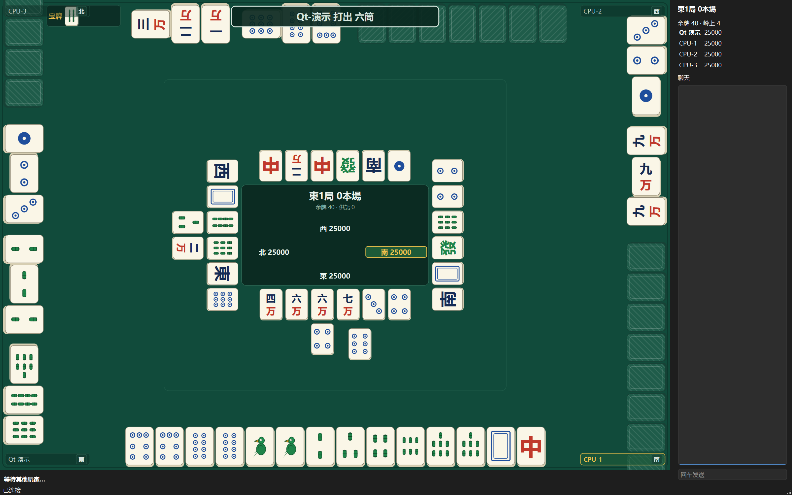

# 立直麻将（日本麻将）· 四人联网对战

一个可以直接开打的**四人日本麻将（立直麻将）**游戏：一个人也能玩（有机器人补位），
也可以叫上朋友连同一台服务器开一桌。

## 三分钟开打

1. **拿到客户端**：`mahjong-client.exe`。**整个文件夹一起拷走**即可运行 ——
   不需要安装 Qt，也不需要配置任何环境变量。
2. **双击运行**，在顶部填服务器地址（例如 `example.com:10086`；本机测试填 `localhost:10086`），点「连接」。
3. **创建房间**（或从房间列表里加入别人的房间）。一个人的话，勾上「补 3 个机器人」。
4. 点「准备」。四家都点了准备就开局。

> 想自己开一台服务器？从 [Releases](https://github.com/Tetrachlorosilane/sMahjong/releases)
> 下载 `sMahjong-server-v<版本>.zip`，解压后 `./start.sh` 就跑起来了（默认监听 `10086`）。
> 包里还带 `stop.sh` / `restart.sh` / `status.sh`，以及**自动更新**的 `update.sh`
> ——详细步骤、防火墙、systemd 常驻见 `docs/DEPLOY.md`。

## 怎么操作

| 操作 | 怎么做 |
| --- | --- |
| **出牌** | 轮到你时**点手牌**里要打出的那一张。刚摸到的牌在最右侧、单独一格 |
| **摸切** | 直接点最右侧那张刚摸到的牌 |
| **立直** | 听牌且条件满足时会亮起「立直」按钮；点亮它，**再点你要打出的宣言牌** |
| **鸣牌 / 和牌** | 别人打出你要的牌时，下方会自动出现对应按钮（吃 / 碰 / 杠 / 荣和 / 跳过） |
| **看结算** | 每局结束弹出结算：番数、符数、点数收支、宝牌。牌面示意会**一行一行浮现**出来，弹窗停留 **10 秒**（比原来长很多，足够看清），点「确定」可立刻进下一局 |
| **音效** | 吃 / 碰 / 杠 / 立直 / 自摸 / 荣和 / 提示 / 自己摸牌各有声音。开关与音量在「个人设置」里（也可以换成材质包里的音效） |
| **聊天** | 右侧栏可以发言，同房间的人都能看到（输入框右边的「发送」按钮，或直接按回车） |
| **立直后** | 立直之后只能摸切，客户端会**自动帮你打开「自动摸切」**（随时可以自己关掉） |

**牌桌下方有三个开关**（随时可开关，**每小局结束和每小局开始各复位一次为关**）：

| 开关 | 作用 |
| --- | --- |
| **自动胡了** | 能自摸就自摸、能荣和就荣和 |
| **不吃碰杠** | 别人的舍张一律不叫（但**能荣和时不会替你跳过**） |
| **自动摸切** | 轮到自己就把刚摸到的那张打出去（摸到的牌**能自摸时绝不打出**） |

> 「自动胡了」永远优先于另外两个：开着自动摸切也不会把能胡的牌打掉。

**牌桌下方还有一个「结束对局」按钮**（对局进行中才出现）：

| 操作 | 怎么做 |
| --- | --- |
| **结束对局** | 点它发起一次投票，**在场的人**（机器人不算、掉线的人不算）各自点「同意 / 不同意」。**同意的人超过在场人数的一半**（1 人 → 1 票、2 人 → 2 票、3 人 → 2 票、4 人 → 3 票）就当场结束这一场，按当前点数结算；票不够就继续打。**发起人自己算同意**（他点按钮就是在表态） |
| 投票冷却 | 一次投票有了结果之后，**5 分钟内谁都不能再发起**（计时在服务端，界面上会显示还剩多久） |

**掉线了不会散桌**：对局中有人掉线或退出时，那一格会标成**「掉线」**（座位上仍写着他的名字），
牌局**照常继续**：轮到他时**自动摸切**（只打刚摸到的那张），**不会**替他吃碰杠、更不会替他胡牌，
也不会换成电脑代打。其他三家不受影响；**四个人全掉线**时房间才会被回收。
掉线的人重新连回来（同一个身份）会**直接接回原来的座位**，牌局不重开、手牌还在。

## 机器人用哪一代 AI

电脑玩家（`CPU-1`…）默认是内置的牌效 AI。服务端可以**另外挂上训练出来的各代网络**，
让你挑一代来打：

| 在哪 | 怎么用 |
| --- | --- |
| **建房间时** | 「机器人 AI」下拉框里选一代（或选「跟服务端默认」不指定） |
| **等待室里** | 房主在按钮排里改「机器人 AI」；**牌局进行中不可改**（同一场里只能是一代） |
| 桌上怎么认 | 选了非默认的那一代时，座位名会带上它（如 `CPU-1·ppo2-g04`），一眼看得出在跟谁打 |

下拉框里的**清单由服务端决定**（`--bot-ai-reg 名字=策略串` 或 `--bot-ai-dir <ckpt 目录>`，
后者把每个含 `net.bin` 的子目录按目录名挂上，比如 `ppo2-g04`）。客户端只发**名字**、
不发文件路径 —— 所以这个功能不会让房间去读服务器上的任意文件。

## 身份（下次连上还是你）

客户端第一次连上服务器时会拿到一个**身份号**（uuid），存在你自己的 `settings.json` 里，
之后每次连接都带着它 —— 服务端据此认得"还是这个人"：掉线回来能接回座位，
以后还会用它记住战绩之类的东西。**昵称仍然是昵称**，桌上显示的一直是你填的昵称。
服务端会定期清理**两个月没登录**的身份记录（`--uuid-ttl-days` 可调）。

> 换电脑/重装客户端时，把这台机器上 `settings.json` 里的 `uuid` 一并带过去，就还是同一个身份。

## 本作采用的规则

默认按 **M.League（麻将联赛）** 的竞技规则来，**建房间时可以逐项改**（也可以一键切到
「一般规则 /《天凤》」或「《雀魂》」，见 `docs/PROTOCOL.md` §5 的预设表）。

M.League 与一般规则主要差在这几处：

- **役满不加倍**：国士无双十三面、四暗刻单骑、纯正九莲宝灯、大四喜这 4 种在一般规则里算
  "两倍役满"，M.League 只算 1 倍（役种名照旧显示）。
- **没有累计役满**：番数再高，普通役的上限也只有三倍满。
- **切上满贯**：3 番 60 符、4 番 30 符按满贯计。
- **连风雀头 2 符**（一般规则 4 符）。
- **无中途流局**：九种九牌、四风连打、四家立直、四杠散了都不流局；三家和了改判**头跳**。
- **无击飞、无和了止、无流局满贯、无西入**：半庄一直打到南 4 局庄家轮庄。
  切到《天凤》/《雀魂》时这两条会打开，并且多一个**「一位必要点数」**输入框（房主自填，
  0 = 不要求；《天凤》《雀魂》段位场是 **30000**）：它决定 All Last 轮庄后要不要进延长战
  （东风战→南入、半庄战→西入，**没有北入**），以及 All Last 庄家能不能**和了止 / 听牌止**
  （庄家达到该点数且是 1 位时，"庄家和了"或"荒牌流局庄家听牌"都直接结束对局）。
- **终局余棒**：半庄结束时供託里的立直棒归 1 位；若 1 位**并列**，由并列的几家按
  M.League 规定均分（例如 3 人并列 1000 点 → 400/300/300，尾数归更接近起家的一家）。
- **立直更宽松**：手上不足 1000 点、残牌不足 4 张也能立直，但**摸到海底牌之后不能立直**。
- **立直后的暗杠**要求"所听的牌不变"**且"面子构成不变"**（允许役种增减）。
- **包牌**包含四杠子；包牌的人只承担被包的那一役。
- **精算**：`(点数 − 30000)/1000 + 马点(10-30) + 头名赏(20)`，同点时平分对应名次的加点。
- **思考时间**：默认 **`20+5`**（总额外 20 秒 + 每巡 5 秒），建房间时可选其它档。
  每巡先给基本时长，超出部分从总额外时长里扣，**额外时长每小局重置**。
- **《雀魂》特有的两条**（切到《雀魂》预设时才生效，《天凤》和 M.League 都没有）：
  ① **天和**时成立国士无双 → 视作**国士无双十三面**（只有天和算，地和不算）；
  ② **国士无双可以抢暗杠**（别人暗杠的那张正好是你国士听的那张时可以荣和；
  被抢时那次杠**不成立**：不翻杠宝牌、不打断一发、也不计入杠数）。

功能与实现：

- **役种**：37 种标准役全部实现（含所有役满与两倍役满）；另有可选古役
  （燕返、杠振、十二落抬、五门齐、三连刻、一色三顺、人和、大车轮、大七星、石上三年等，默认关闭）。
- **点数**：高点法（自动取打点最高的那种解释，所以七对子 / 二杯口之类不会算错）、
  完整符数计算、满贯～役满，以及庄闲 / 荣和 / 自摸 / 本场棒 / 立直棒 / 包牌的全部授受方式。
- **振听与禁手**：舍张振听、同巡振听、立直后振听；禁止食替；立直后暗杠不得改变听牌。
- **宝牌**：表宝牌、里宝牌、杠宝牌、赤宝牌（默认 3 张，也可以设为 0 张）。
- **流局**：荒牌流局 + 不听罚符 3000 点；中途流局与流局满贯按预设开关。
- **一局进程**：连庄 / 轮庄、本场、供托；终局按马点 + 头名赏精算点数。
- **四杠散了**：两家以上合计开满 4 次杠、且第 4 次杠后那张岭上牌没有放铳，即强制流局；
  岭上开花 / 被抢杠 / 岭上牌放铳这三种情况下**不流局**（该规则未启用的预设下不流局）。
- **观战**：**牌局进行中也能进来观战**（不会再被拒或进到莫名其妙的状态）——
  看到的是公开信息（四家牌河、副露、点数、宝牌指示牌、谁在摸牌），**看不到任何人的手牌**；
  点**名牌**或上面那条「视角」下拉可以把视角切到任意一家（谁摆在下方的意思），
  观战者不能出牌。局间会自动跟上，不用重连。
- **副露可以选择用哪张赤五**：手里同时有赤五和普通五时，点「碰」（大明杠同理）会弹出**子选项**，
  一条一种取法（例如「五筒 五筒」与「赤五筒 五筒」），点哪条就用哪张；
  手里**只有赤五或只有普通五**时不弹子选项，直接执行（没什么可选）。不指定时**默认用普通五**，
  不会偷偷吃掉赤五。
- **机器人**：内置启发式 AI（补位用，单人也能打完一场），按几层取舍打牌 ——
  **牌效**（向听 + 实际进张枚数，听牌优先两面）、
  **押し引き**（有人立直、或有人鸣开得很明显时算期望值：`和了概率 × 和了点 − 放铳概率 × 平均放铳失点`，
  打点高就推、远手小牌就撤；撤的时候挑对威胁家最安全的牌）、
  **打点与役**（同效率留宝牌、够大就默听、鸣牌前先确认鸣完还有役）、
  **副露打分**（门清手要么鸣完直接听牌、要么鸣完至少 2 番，否则留着门清做立直）、
  **开杠**（会开暗杠/加杠/大明杠，但不会为了杠丢掉听牌、也不会加杠一张看着会放铳的牌）、
  **看顺位**（领先时收着打、落后时抢分，最后一局的最极端；四种顺位各有一条"值不值得推"的门槛）、
  **终局见逃**（最后一局里，如果这次荣和抬不动名次、自摸才抬得动，会放掉这张牌去等自摸；
  立直中不会见逃——那会变成立直振听）。

## 常见问题

| 现象 | 怎么办 |
| --- | --- |
| 连不上服务器 | 检查地址与端口；服务和客户端在**同一台机器**上时，地址填 `localhost` 最保险 |
| 大厅里的按钮是灰的 | 还没连上。先点「连接」，连上后按钮才会亮 |
| 双击 exe 没有反应 | 客户端文件夹要**整个**一起拷贝；缺了同目录的 DLL 就启动不了 |
| 牌面显示成 `1m`、`0p` 这种文字 | 那是**占位牌面**：这份客户端的 `tiles/` 里放的是占位素材。换成正式素材，或删掉该目录改用内置画法 |
| 结算界面里的牌是文字不是牌图 | 客户端文件夹里的 `fonts/` 丢了 —— 字库取不到时会退回文字显示 |
| 想换一套牌面美术 | 直接替换 `tiles/` 里的同名文件（文件名 = 牌码），**重启客户端即生效，不用重新编译** |
| 有人掉线了，怎么还在打？ | 这是故意的：掉线的人**托管**（只自动摸切、不吃碰杠、不会胡牌），牌局继续；他连回来会接回原位。四个人全掉线才会散桌 |
| 「结束对局」按钮点不动 | 可能刚投过一次票：**冷却 5 分钟**（按钮下方的状态行会写还剩多久）。也可能不在对局中 |
| 投票通过了，为什么还要等？ | 不会等 —— 服务端会立刻收口并弹总结算。若是「票不够」那就是**否决**，本场继续打 |
| 重装客户端之后"不认识我了" | 把原来 `settings.json` 里的 `uuid` 拷到新客户端（见上面「身份」一节） |

## 对局回放

服务端会把每场半庄**完整记下来**（含起始牌山、每一次摸牌/打牌/鸣牌/立直/和牌/流局，以及聊天），
打完一场就能复盘，**重启服务端也不会丢**（记在服务端目录的 `replays/` 里）。

- **入口**：大厅里的「对局回放」（列出服务端保存的场次，双击一场开始；也可以直接粘回放 ID），
  以及**整场总结算**弹窗上的「看本局回放」。
  （牌局还没打完时不给这个按钮 —— 那时候记录还没写下去，点了也读不到。）
- **怎么翻**：上一步 / 下一步（每次一个操作）、上一巡 / 下一巡、上一小局 / 下一小局、
  跳到指定巡目、播放（自动一步步放）。也可以直接点右边的操作列表跳到某一步。
  **右边的操作记录按小局分开**：只列当前这一小局的记录，换小局自动换掉，不会一场上千条挤在一起。
- **动画**：只有「往前走一个操作」（点「下一步」或播放的每一拍）才播牌的飞行动画；
  跳着看（上一步、换巡、换小局、点列表跳转）都是直接换画面 —— 不然每跳一次都会把前面几巡的牌重打一遍。
- **视角**：默认按 1 号位（起家）看，可以切成任意一家的视角 —— 和实时对局看到的画面一致。
  切法有两个：右上角「视角」下拉框，或者**直接点牌桌上那一家的名字牌**。
- **看别家手牌**：「显示他家手牌」按钮可以切换 —— 打开后四家手牌全部亮出来（回放本身是上帝视角，
  关着的时候只看得到牌背，但**张数**同样是真实的）。打开后：
  - 别家手牌**张数与牌面都是真的**（副露拿走的那几张不会还留在手里），并按与自家一样的规则**自动理牌**；
  - 别家打出的牌，飞行动画从它**真正待着的那一格**飞出去（正式对局里客户端看不到别家的手牌，
    所以那里的起飞位置是**故意随机**的 —— 免得看久了反推出别人的手牌顺序；回放没有这个顾虑）。
- **每小局结算**：工具栏上的「本局结算」随时能看当前这一小局的结果；播放放到一小局结束时
  也会自动弹出来，**并且会停在那里等你点确认**，不会自动关掉、也不会倒计时。
- **牌山视图**（「牌山视图」按钮，单独开一个窗口）：136 张按**真实抓牌顺序**铺成一条序列 ——
  **每列 4 张**（从上往下读），每 4 列留一个空隙方便对照；末尾 14 张是王牌
  （4 张岭上 + 5 张表宝牌指示牌 + 5 张里宝指示牌），仍在同一条序列里，只是底色不同。
  ⚠ **不按玩家分行**：吃碰杠会改变下一个摸牌的人，按玩家分行是错的。
  "4 张一组"只是给你看着不眼花的阅读分组。
  每张牌按**当前进度**着色（牌背＝还没摸到、牌面＝已摸到，灰＝已打出、绿框＝已副露、
  王牌＝黄底、红框＝这一步刚拿走的那张），**牌底部那条细线的颜色表示这张是谁拿走的**
  （四家的颜色在窗口标题行有图例），点某张牌还能跳到"它被摸走"的那一步。
- **导出天鳳牌谱**：工具栏「导出牌谱」一次写**两份**：
  - `<名字>.txt` —— 天鳳 `tenhou.net/6` 的链接（格式参考 [wuye999/tenhou](https://github.com/wuye999/tenhou)）：
    **第一行就是链接**，整行粘到浏览器即可查看这一场。
  - `<名字>.xml` —— **完整天鳳牌谱（mjlog XML）**：配牌、每一张摸牌/打牌（含摸切）、
    吃碰杠/暗杠/加杠、立直宣言、杠宝牌、和了与流局**全都在**，可以喂给天鳳系的分析/AI 工具。
  ⚠ 两点说明：① 这份格式**没有副露的表示**（参考项目本身如此），所以有鸣牌的小局里看不到副露；
  ② 最后一个"结果"元素是尽力而为（和了/流局），预览牌河为主。
- **说明**：回放是**上帝视角** —— 四家手牌与整副牌山的顺序都能看到。所以回放记录
  只在牌局结束后才可读，ID 是随机生成的 10 位字符串，且服务端有速率与容量上限
  （默认最多留 50 场 / 96 MB，超出自动淘汰最旧的）。

## 个人设置与材质包

- **个人设置**：大厅右下角「个人设置」里可以改**服务器地址/端口、昵称、材质包**，
  点确定就生效并写进 `settings.json`（放在 exe 旁边；那里不可写时放用户配置目录，
  设置界面底部会显示实际路径）。从大厅连过一次服务器，地址/端口/昵称也会自动记住。
  这个文件**怎么坏都不会让客户端起不来**：缺了就按缺省值生成，某一项不合法就只重置那一项，
  认不出的项原样保留。
- **材质包**：能把**牌面/牌背、桌布、立直棒、音效、UI 字体**换成自己的素材
  （结算界面那套麻将牌字体不在此列）。
  - 支持**文件夹**或 **zip**（`.7z`/`.tar.gz` 之类不支持 —— Qt 没有对应读取 API，
    本项目不想为它引入第三方库；请转成 zip 或直接用文件夹）。
  - 包内放一份 `theme.json` 说明"哪类素材在哪个文件夹"，**没写的类别就用默认素材**；
    某一类坏了也只回退那一类，其余照常。矢量（`.svg`）与位图（`.png/.jpg`）都认，
    位图会自动拉伸到该有的尺寸。
  - 包格式、文件命名、每个错误提示的含义、以及自己做一个包的完整说明见
    **[docs/THEME.md](docs/THEME.md)**。

## 许可与致谢

- **规则依据**：[奇葩栖息地 wiki 的日本麻将词条](docs/日本麻将.md)（随仓库附带，2026-09-14 版、
  1494 行 —— 该版逐节标注了《雀魂》《天凤》与 M.League 的规则差异）。
- **结算界面的牌面字体** `I.MahjongJP.otf` 采用 **M+ 字型授权条款**：可自由使用、复制、分发、修改，
  商业与非商业均可 —— 随程序一起分发是合规的。
- **随程序分发的第三方组件**（Qt 6、MinGW 运行时）各自的许可文本都在客户端文件夹的 `licenses/` 里。
  把整个文件夹拷给别人时，**请一并保留**（这是 Qt 的 LGPLv3 要求，删掉就不合规了）。

---

> **这份文档是给玩家看的。** 想自己编译、改代码、跑测试，或了解架构与协议：
> `AGENTS.md`（**开发手册，先看这份**：铁律 / 构建 / 验证 / 约定）、
> `NOTES.md`（**开发细节分册**：完整案例与红证、几何推导、全量症状表、已知限制）、
> `docs/DESIGN.md`（设计）、`docs/PROTOCOL.md`（协议）、`docs/DEPLOY.md`（部署）、
> `client/README.md`（客户端构建细节）、`docs/AUDIT.md`（审计与修复清单）。
